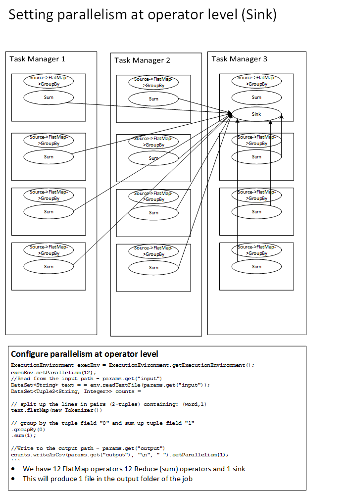

# Flink Architecture #
In this article we will explore the Flink Architecture in the context of the [WordCount](https://github.com/apache/flink/blob/master/flink-examples/flink-examples-batch/src/main/java/org/apache/flink/examples/java/wordcount/WordCount.java) application from the [flink-examples](https://github.com/apache/flink/tree/master/flink-examples) project.

The key lines which perform the word counting in Flink are-
    
```
ExecutionEnvironment execEnv = ExecutionEvironment.getExecutionEnvironment();

//Read from the input path - params.get("input")
DataSet<String> text = = execEnv.readTextFile(params.get("input"));
DataSet<Tuple2<String, Integer>> counts = 
// split up the lines in pairs (2-tuples) containing: (word,1)
text.flatMap(new Tokenizer())
// group by the tuple field "0" and sum up tuple field "1"
.groupBy(0)
.sum(1);
//Write to the output path - params.get("output")
counts.writeAsCsv(params.get("output"), "\n", " ");
```

The key features of the above program are:

1. **Read from source** - Read the file(s) from the input path(folder) and create a DataSet<String> instance
2. **Map operation** - Use a FlatMap operator to convert each line to a pair - (word,1)
3. **Shuffle operation** - Group the output of FlatMap operator by word 
4. **Reduce operation** - Add up the 1's for each word and produce a final count for each word
5. **Write to Sink** - Write to the output path


## Physical Architecture ##

We will assume the physical architecture shown in Figure 1.


Figure 1: Physical Architecture of the Flink Cluster

The physical architecture has the following characteristics:
1. 1 Job Manager node 
2. 3 Task Manager nodes
	- Assume 4 CPU cores per Task Manager
	- Assume 25 GB memory per Task Manager node 
3. Each Task Manager must have a unique IP address

Figure 1 shows how to configure the heap memory for the Job Manager and Task Manager nodes using the flink-config.yaml or when starting a Flink Cluster in YARN:
- In the standalone cluster mode we modify the `flink-config.yaml` config file and set the following properties
	- `jobmanager.heap.mb: 5000` (5000MB)
	- `taskmanager.heap.mb: 20000` (20000MB)  
- When running Flink on YARN with the same configuration we launch the Flink Application Master as follows (property `jm` defines the Job Manager Memory and property `tm` defines the Task Manager memory)   
`bin/yarn-session.sh -n 3 -s 4 -jm 5000  -tm 20000`

The overall workflow for job submission is as follows:
1. The Client will submit a job to the Job Manager along with the locally accessible (to the client) path to the JAR file containing all the classes needed by the job.
2. The Job Manager will evaluate the logical execution plan for the job and create physical execution plan where it will assign tasks to task slots in various Task Managers. It will do so in a way that minimizes network chatter and maximize Task Manager or even Task Slot local processing.
3.  The Job Manager will ship the client JAR file to each Task Manager.
4.  The Job Manager will initiate the job.
5.  The Task Managers will communicate their status to the Job Manager.
6.  The Client will monitor the job status by querying the Job Manager.

## Logical Architecture ##

The Logical Architecture for each Task Manager is depicted in Figure 2. 


Figure 2: Logical Architecture for a Task Manager 


The characteristics of the Task Manager are:

-  Each Task Manager runs a single Java Virtual Machine. 
-  Task Slots are started by each Task Manager. A Task Slot is unit of parallelism in Flink. It defines the container in which each operator executes. It also defines the number of pipelines available over which one Task Slot hands work to another Task Slot.

The number total number of task slots should be ideally equal to the number of CPU cores. But it can be higher. Each Task Slot runs in its own thread. 

We will assume 4 Task Slots per Task Manager. The Task Slots per Task Manager can be configured in two ways:

- In the standalone cluster mode we modify the `flink-config.yaml` config file and set the property `taskmanager.numberOfTaskSlots:4`. 
- When running Flink on YARN we configure it when we launch the Flink Application Master (3 Task Managers (-n 3) and 4 Task Slots per Node Manager (-s 4)  
`bin/yarn-session.sh -n 3 -s 4 -jm 5000  -tm 20000`
 

## Running Word Count with default parallelism ##

Next we launch the [WordCount job](https://github.com/sameeraxiomine/flinkinaction/blob/master/appendix/FlinkOnAWSEMR.md) in the cluster. How does Flink know how to set the default parallelism for the Job. Again there are two places where it can be set-

- The `flink-config.yaml` config file defined a property `parallelism.default:4`. Default value is 1 when you download Flink. We modified it to 4. You need to ensure that it's value is less than or equal to the maximum number of Task Slots (No of Task Manager x No of Task Slots per Task Manager)
-  When you launch the program using ./bin/flink command you can pass the parameter `-p 4` to configure default parallelism = 4. This setting overrides the setting in the `flink-config.yaml`

Figure 3 shows how the Word Count program is configured for execution with this setting. Notice how the Job Manager evenly distributes the work load across all nodes.


Figure 3: WordCount application executing with default parallelism=4 

### Configure default parallelism in the program###

Assume you need to maximize the level of parallelism and you want to do so in the program. You can set the default parallelism within the program by invoking the `setParallelism(int)` method on the `ExecutionEnvironment` instance as follows:

```
ExecutionEnvironment execEnv = ExecutionEvironment.getExecutionEnvironment();
execEnv.setParallelism(12);
```
The above set of lines will override the default parallelism set via `./bin/flink -p 4` command

Figure 4 shows the physical execution plan for WordCount program. 


Figure 4: Override default parallelism in code (maximize parallelism) 


## Operator Level Parallelism##

By default all downstream operators inherit the degree of parallelism from the upstream operator. You can configure the degree of parallelism for each operator. This setting overrides the default parallelism passed to the job or configured on the ExecutionEnvironment setting. 

###Define Sink Parallelism = 1 ###

By default we have 12 sinks. This gives us 12 files  in the output folder. Assume we need only one file in the output folder. To do this we need to define parallelism of 1 for the sink operator. We do that by modifying the sink specification in the program as follows:
```
counts.writeAsCsv(params.get("output"), "\n", " ").setParallelism(1);
```

Thus all Reduce (sum) operators will stream their output to the single Sink as shown in Figure 5.



Figure 5: Override parallelism for the Sink operator 


### Define Reducer Parallelism = 3 and Sink Parallelism = 1 ###

Next we decide that we do not want to run 12 Reduce(sum) tasks. By default the Reduce(sum) operator inherits the degree of parallelism from the upstream FlatMap operator which is 12. We can change the Reduce(sum) operator to have parallelism of 3 and the Sink operator to have parallelism of 1 as follows:

```
DataSet<Tuple2<String, Integer>> counts = 
text.flatMap(new Tokenizer())
.groupBy(0)
.sum(1).setParallelism(3);

counts.writeAsCsv(params.get("output"), "\n", " ").setParallelism(1);
```

Figure 6 shows the physical execution plan for this setup.


Figure 6: Override parallelism for the Reduce and Sink operators 


Notice how each Task Manager gets one Reduce task so that work load is evenly distributed. Each Reduce task still needs to stream its output to the Sink task.
 
## References ##
[Apache Flink Hands On by Robert Metzger](http://www.slideshare.net/robertmetzger1/apache-flink-hands-on)
