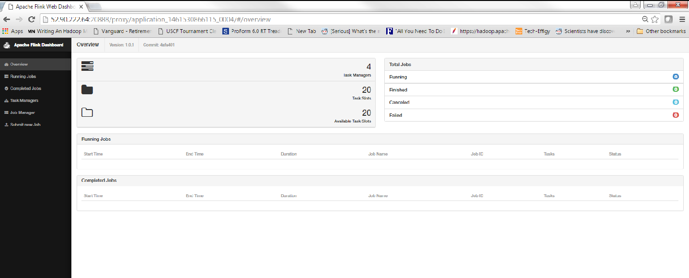
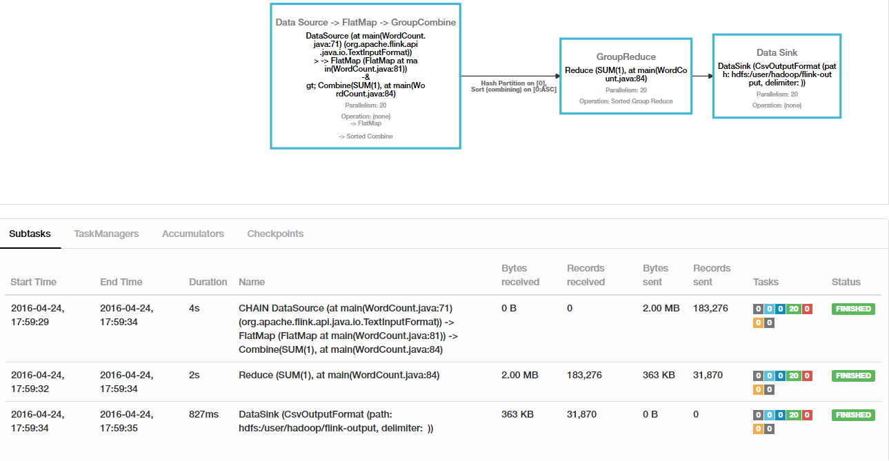

# Running Flink on YARN using Amazon Elastic MapReduce
In this appendix we will show to run Flink on the Amazon Elastic MapReduce (EMR) service. We will describe the following steps:
1. Starting the EMR Cluster
2. Installing Flink on the EMR Cluster
3. Starting Flink in the detached mode on Yarn. 
4. Running a simple WordCount application from the sample examples provided with the Flink installation

## Start the EMR Cluster

The first step is to start the EMR cluster. Instructions on how to start the EMR cluster can be obtained at this [link](http://docs.aws.amazon.com/ElasticMapReduce/latest/ManagementGuide/emr-what-is-emr.html). We have started an EMR cluster with the following characteristics:

- Release Label - emr-4.6.0
- Master Node instance type - m3.2xlarge
- Core Node instance type -  m3.2xlarge
- No of core nodes - 2

Thus our EMR cluster comprises of 1 master node and 2 core nodes. Each of the m3.2xlarge has 8 virtual CPU's and 30 GB of RAM. We can think of each virtual CPU as two core. Thus our cluster has 32 cores and 60 GB RAM in the core nodes. Only 45 GB of RAM is made available to run our jobs. These are configured for the YARN cluster started by AWS EMR. For more information on YARN configuration refer to the following [link](http://hadoop.apache.org/docs/current/hadoop-yarn/hadoop-yarn-site/YARN.html).   

## Install Flink in the EMR Cluster

Identify the public IP address of the master node of the EMR cluster and SSH into it using the same key which was used to start the EMR cluster. The following [link](http://docs.aws.amazon.com/ElasticMapReduce/latest/DeveloperGuide/EMR_SetUp_SSH.html) contains instructions on how to do that. 

Next run the following command in the home folder that you just logged into-

```
curl http://apache.claz.org/flink/flink-1.0.1/flink-1.0.1-bin-hadoop27-scala_2.10.tgz | tar xz
```

This should install Flink and you will see the following folder in your home directory (`/home/hadoop`)

`flink-1.0.1`

Note: The exact link you download from and the version of flink will evolve with time. Please take the time to check and install the correct version of Flink when you are reading this article.

## Start Flink in the detached mode on YARN

Next we start Flink in the detached mode. In this mode the Flink cluster is started on the YARN cluster and it does not terminate. For all practical purposes this implies that Flink will not be installed in cluster mode as a YARN application. We can proceed to run/monitor jobs on it like we would run/monitor jobs on Flink if it were installed in cluster mode. 

The command to start Flink on YARN in the detached mode is

```
HADOOP_CONF_DIR=/etc/hadoop/conf flink-1.0.1/bin/yarn-session.sh -n 4 -jm 1024 -s 5 -tm 10240 -d
```

We need to tell Flink where the YARN configuration files are. Hence we need to explicitly pass the `HADOOP_CONF_DIR` to the command `flink-1.0.1/bin/yarn-session.sh` in the Flink installation. The -d option tells YARN to start Flink in the detached mode. This starts up Flink on YARN and leaves it running. This allows us to use Flink like we had setup Flink in a cluster mode on a set of servers.

The Flink cluster is now started with the following characteristics:
- Job Manager process is running on the EMR master node and has been allocated 1GB of memory
- 4 Task Managers are running each with memory 5GB. Each Task Manager is assigned 5 task slots. Thus each slot will be assigned 1GB of memory. Our production cluster would be much larger and we might choose to provide between 2GB-4GB of RAM to the task slots in the production cluster. But since this is an illustration we started a very small cluster and will provide limited memory to our task slots. 

The following [link](https://ci.apache.org/projects/flink/flink-docs-master/setup/config.html#configuring-taskmanager-processing-slots) illustrates the relationship between the Task Managers and Task Slots.


The console output for the above command will indicate the Job Manager URL. Search for the following lines-
```
2016-04-24 21:43:06,175 INFO  org.apache.flink.yarn.FlinkYarnClient                         - The Flink YARN client has been started in detached mode. In order to stop Flink on YARN, use the following command or a YARN web interface to stop it:
yarn application -kill application_1461530866115_0004
Please also note that the temporary files of the YARN session in the home directoy will not be removed.
Flink JobManager is now running on 172.30.0.43:33043
JobManager Web Interface: http://ip-172-30-0-135.ec2.internal:20888/proxy/application_1461530866115_0004/
2016-04-24 21:43:06,379 INFO  org.apache.flink.client.FlinkYarnSessionCli                   - The Flink YARN client has been started in detached mode. In order to stop Flink on YARN, use the following command or a YARN web interface to stop it:
yarn application -kill application_1461530866115_0004
Please also note that the temporary files of the YARN session in hdfs://ip-172-30-0-135.ec2.internal:8020/user/hadoop/.flink/application_1461530866115_0004 will not be removed.
```
The line which provides the Job Manager URL is
```
JobManager Web Interface: http://ip-172-30-0-135.ec2.internal:20888/proxy/application_1461530866115_0004/
```

Replace the `ip-172-30-0-135.ec2.internal` with the IP address you used to SSH into the master node (Ex. `52.90.222.64`) and you will be able to see the following screen-


Notice that we have 4 task managers and 20 slots available just like we configured.

## Run the WordCount application from the examples folder of the Flink installation

Now that we have our Flink installation running, let us run a flink application in cluster mode. We will turn to the HelloWorld of Big Data applications, the WordCount application. The WordCount application is available in the following path

`/home/hadoop/flink-1.0.1/examples/batch/WordCount.jar`


### Prepare our data ###
But first we need some data. Let us download some data and add it to the Hadoop File System (HDFS). You can read more about the HDFS [here](http://hadoop.apache.org/docs/current/hadoop-project-dist/hadoop-hdfs/HdfsUserGuide.html).

AWS makes data available for certain types of applications. For the WordCount application we can access data from the following S3 bucket - `s3://elasticmapreduce/samples/wordcount/input/`. You do not need to know anything about S3 or HDFS to run the examples in this tutorial. But if you do, AWS makes the S3 documentation available at the following [location](http://docs.aws.amazon.com/AmazonS3/latest/gsg/GetStartedWithS3.html).

The steps we follow to prepare our input data are-

1. Create a input folder in HDFS. Run the following command in the `/home/hadoop` home directory of the master node we have SSH'ed into - `hadoop fs -mkdir myinput`. If you run the command `hadoop fs -ls` following the execution of the prior command you will see the `myinput` folder created in the HDFS.

2. Next we copy the files from the S3 bucket into the new folder we just created in HDFS. The command to do that is - `hadoop distcp s3://elasticmapreduce/samples/wordcount/input/ myinput`. This runs the distributed copy job which copies all the files from the S3 path `s3://elasticmapreduce/samples/wordcount/input/` into our HDFS folder `myinput`. Note that the distcp program also runs as a application on top of our YARN cluster and needs resources. 

One of the reasons we provided each Task Manger only 5 GB of memory instead of 10 GB. We needed the resources to start the distcp application. If you plan to run other jobs on the same YARN cluster you need to reserve some resources for those jobs. Or else those jobs will not start since the [Resource Manager](http://hadoop.apache.org/docs/current/hadoop-yarn/hadoop-yarn-site/ResourceManagerRestart.html) of YARN cannot allocate resources to those jobs. 

Now execute the `hadoop fs -ls myinput/input` command in the console and you will see the following listing. Each of the files `0001` through `0012` contains text data which will serve as the input to our `WordCount` program.

```
[hadoop@ip-172-30-0-135 ~]$ hadoop fs -ls myinput/input
Found 12 items
-rw-r--r--   1 hadoop hadoop    2392524 2016-04-24 21:42 myinput/input/0001
-rw-r--r--   1 hadoop hadoop    2396618 2016-04-24 21:42 myinput/input/0002
-rw-r--r--   1 hadoop hadoop    1593915 2016-04-24 21:42 myinput/input/0003
-rw-r--r--   1 hadoop hadoop    1720885 2016-04-24 21:42 myinput/input/0004
-rw-r--r--   1 hadoop hadoop    2216895 2016-04-24 21:42 myinput/input/0005
-rw-r--r--   1 hadoop hadoop    1906322 2016-04-24 21:42 myinput/input/0006
-rw-r--r--   1 hadoop hadoop    1930660 2016-04-24 21:42 myinput/input/0007
-rw-r--r--   1 hadoop hadoop    1913444 2016-04-24 21:42 myinput/input/0008
-rw-r--r--   1 hadoop hadoop    2707527 2016-04-24 21:42 myinput/input/0009
-rw-r--r--   1 hadoop hadoop     327050 2016-04-24 21:42 myinput/input/0010
-rw-r--r--   1 hadoop hadoop          8 2016-04-24 21:42 myinput/input/0011
-rw-r--r--   1 hadoop hadoop          8 2016-04-24 21:42 myinput/input/0012
```
 
### Execute the sample WordCount application from the flink installation###

From the home folder of your master node (to which you are already SSH'ed into) run the following command

```
flink-1.0.1/bin/flink run -p 20 flink-1.0.1/examples/batch/WordCount.jar --input hdfs:///user/hadoop/myinput/input --output hdfs:///user/hadoop/flink-output
```

The `flink-1.0.1/examples/batch/WordCount.jar` is the path to the WordCount program provided as a sample application in the Flink installation.

The `-p 20` sets the default parallelism in Flink to 20. We have 20 task nodes. We can provide a value which is less than or equal to the total number of task slots available in Flink.

The `--input hdfs:///user/hadoop/myinput/input` is the path to the input folder in HDFs which contains the files we copies from S3.

The --output hdfs:///user/hadoop/flink-output is the path to the output folder which will be created. We except to see 20 files in them which is the same as the value for the default parallelism. We can override this value by passing a separate value for sink parallelism. For this example let us use the default which is also the most efficient choice.

The program should execute successfully and we can then check the output by executing the command `hadoop fs -ls flink-output` which will produce an output which should look like this

```
-rw-r--r--   1 hadoop hadoop      15864 2016-04-24 21:59 flink-output/1
-rw-r--r--   1 hadoop hadoop      15696 2016-04-24 21:59 flink-output/10
-rw-r--r--   1 hadoop hadoop      15705 2016-04-24 21:59 flink-output/11
-rw-r--r--   1 hadoop hadoop      16735 2016-04-24 21:59 flink-output/12
-rw-r--r--   1 hadoop hadoop      16599 2016-04-24 21:59 flink-output/13
-rw-r--r--   1 hadoop hadoop      16313 2016-04-24 21:59 flink-output/14
-rw-r--r--   1 hadoop hadoop      16139 2016-04-24 21:59 flink-output/15
-rw-r--r--   1 hadoop hadoop      16282 2016-04-24 21:59 flink-output/16
-rw-r--r--   1 hadoop hadoop      15557 2016-04-24 21:59 flink-output/17
-rw-r--r--   1 hadoop hadoop      16352 2016-04-24 21:59 flink-output/18
-rw-r--r--   1 hadoop hadoop      16265 2016-04-24 21:59 flink-output/19
-rw-r--r--   1 hadoop hadoop      16065 2016-04-24 21:59 flink-output/2
-rw-r--r--   1 hadoop hadoop      16156 2016-04-24 21:59 flink-output/20
-rw-r--r--   1 hadoop hadoop      15934 2016-04-24 21:59 flink-output/3
-rw-r--r--   1 hadoop hadoop      15864 2016-04-24 21:59 flink-output/4
-rw-r--r--   1 hadoop hadoop      15334 2016-04-24 21:59 flink-output/5
-rw-r--r--   1 hadoop hadoop      16060 2016-04-24 21:59 flink-output/6
-rw-r--r--   1 hadoop hadoop      15778 2016-04-24 21:59 flink-output/7
-rw-r--r--   1 hadoop hadoop      15863 2016-04-24 21:59 flink-output/8
-rw-r--r--   1 hadoop hadoop      15185 2016-04-24 21:59 flink-output/9
```

As expected we see 20 output files with numbers ranging from 1-20. We can view an individual file using the `hadoop fs -cat` command. For example the `hadoop fs -cat flink-output/20` produces an output which looks like the following-

```
..
aalborg 3
abbreviated 27
abilio 3
aboriginal 12
abroad 355
abubakar 3
accept 24
accounted 17
acdp 9
acharis 3
achilles 3
acquired 29
ada 5
adapted 6
additions 1
adema 9
adp 18
advancing 6
advice 169
aerodrom 3
aeropuerto 3
aerospace 12
affi 3
..
```
 
The above output indicates that the word `advancing` occurs 6 times in the input dataset.

## Review the Program Plan ##

Let us visit the Job Manager URL to view how Flink executed our program. The Job Manager URL shows that we have completed one job successfully. This is the WordCount program we just ran


If we click on the job link we can view how Flink ran our Job. The figure below illustrates the job plan Flink executed


Note how each operator utilizes the value of the Default Parallelism (20) which we passed using the -p option to the flink execution. 

Note the following features of the execution-

- The DataSource utilizes the TextInputFormat. The InputFormat class and it's subclasses are explored in another tutorial. For now remember that this class has the intelligence to split the input into 20 (defaul parallelism) blocks each of which can be consumed by one task. A task runs in one task slot.
- The FlatMap operation and the Combine operation runs in the same task slot. The Combine operation is similar to the Reduce operation but it runs in the same process as the FlatMap instance. This reduces the amount of data that needs to be shuffled across the network. Thus instead of sending `<TEST,1>` from the FlatMap to the Reduce operator, we send `<TEST,25>` if the `FlatMap` instance has seen 25 instances of the `TEST` word prior to sending data over the network to the `Reduce` operator. Thus we have only sent 4% of what we would have sent had we not used the combiner optimization.
- By default Flink uses the Hash Partitioner to partition data between the FlatMap and the Reduce operators. This is equivalent to calling the `<word>.hashcode()%<DEFAULT_PARALLELISM>` to decide which Reduce operator the given word is routed to.
- The Reduce node just forwards the results to the sink operator in the same same task.

# Summary #

In this tutorial we achived the following:

- We learned how to setup a real Flink cluster cheaply using the AWS EMR service. 
- We installed Flink on EMR and start Flink in the detached mode where we can leave it running and submit jobs to it.
- We copied data from a S3 bucket into the HDFS of the EMR cluster
- We ran the sample WordCount application from the flink examples on this data
- We learned how to monitor the Flink cluster running on YARN.